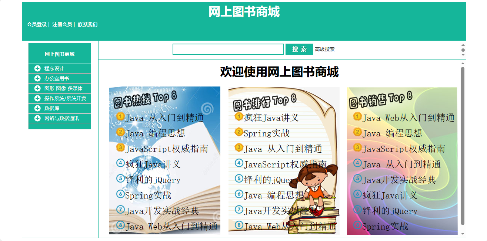
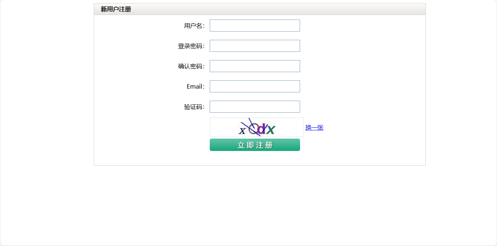
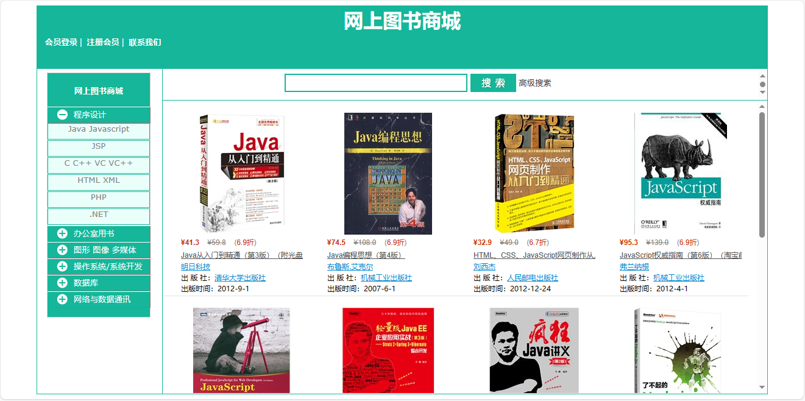
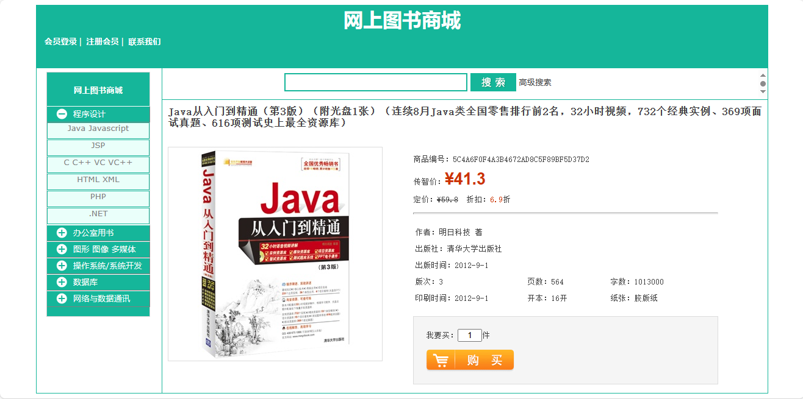
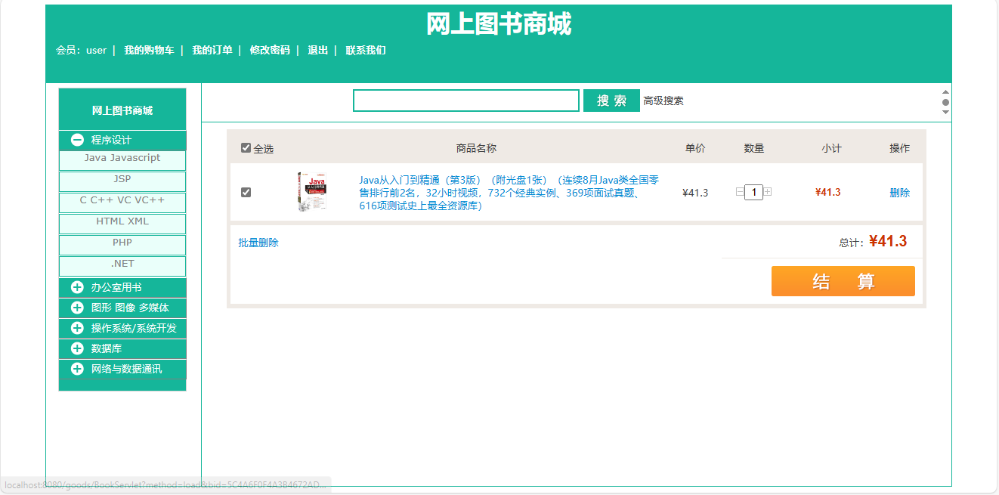
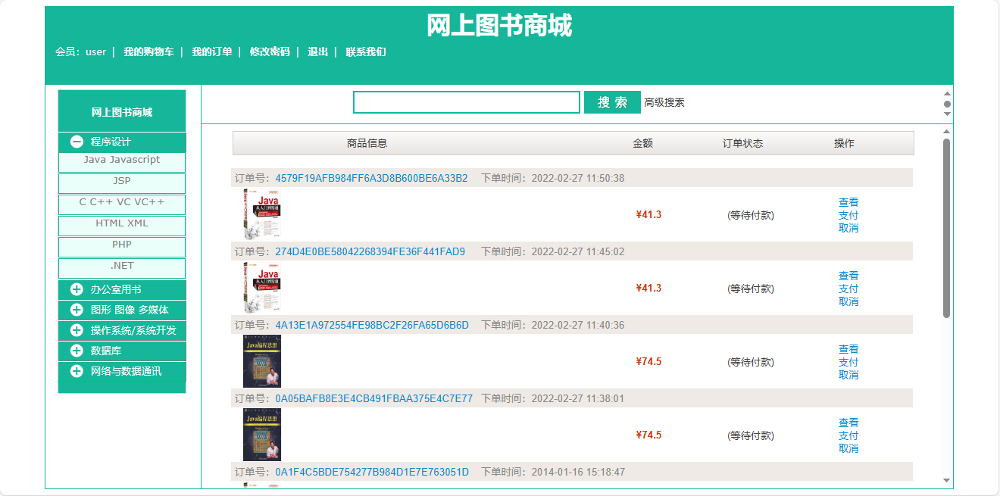
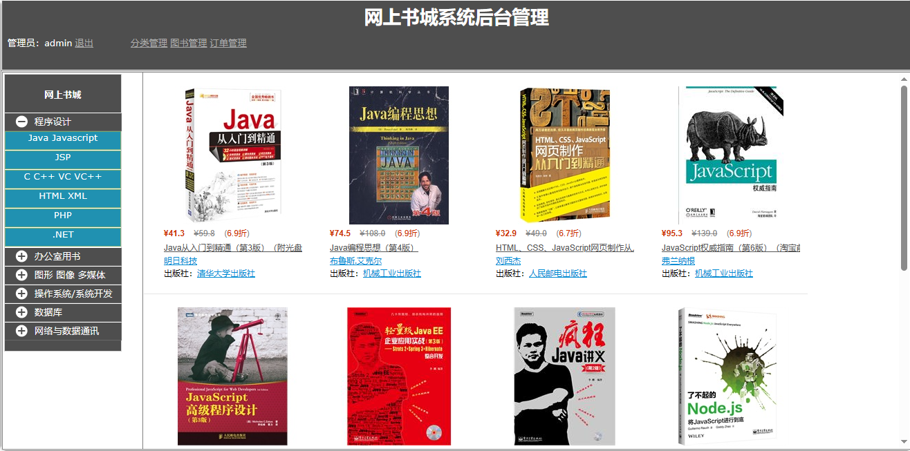
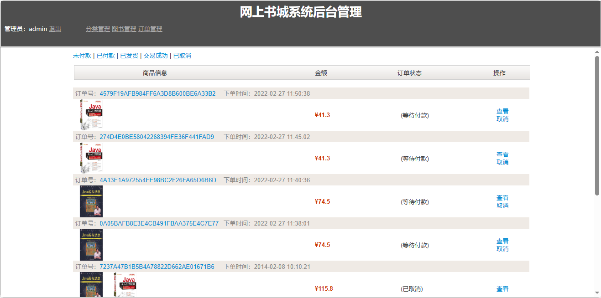

<h1 align="center">网上图书商城</h1>

QQ群: 377586148(加群获取sql文件)

 [个人站点: 从戎源码网](https://armycodes.com/)

## 简介

> 本代码来源于网络,仅供学习参考使用!
>
> 提供1.远程部署/2.修改代码/3.设计文档指导/4.框架代码讲解等服务
>
> 前端登录地址：http://localhost:8080/goods/jsps/user/login.jsp
>
> 用户名： user   密码： 123456
>
> 后端登录地址：http://localhost:8080/goods/adminjsps/login.jsp
>
> 用户名： admin   密码： 123456
>

## 项目介绍

网上图书商城，前端 Jsp、Jquery，后端 Servlet，系统角色分为：用户、管理员，用户在网上图书商城的用户端页面访问浏览图书信息，支持关键词模糊搜索和高级搜索，也支持左侧分类菜单查找图书，添加到购物车，在线下单支付；主要功能如下：

### 用户：

- 基本功能：登录、注册、退出、修改密码
- 图书浏览：树形目录分类、普通搜索、高级搜索（书名、作者、出版社）、图书详情查看、图书购买、购物车、图书结算、批量结算、收货地址、提交订单、在线支付
- 订单：订单列表、订单详情查看、继续支付、取消订单

### 管理员：

- 分类管理：添加一级分类、添加二级分类、分类修改、分类删除
- 图书管理：添加图书（书名、大图、小图、当前价、定价、折扣、作者、出版社、出版时间、版次、页数、字数、印刷时间、开本、纸张、一级分类、二级分类）、高级搜索、图书编辑、图书删除
- 订单管理：订单列表（未付款、已付款、已发货、交易成功、已取消）、订单详情查看、取消订单

## 环境

- <b>IntelliJ IDEA 2009.3</b>

- <b>Mysql 5.7.26</b>

- <b>Tomcat 7.0.73</b>

- <b>JDK 1.8</b>

## 运行截图

